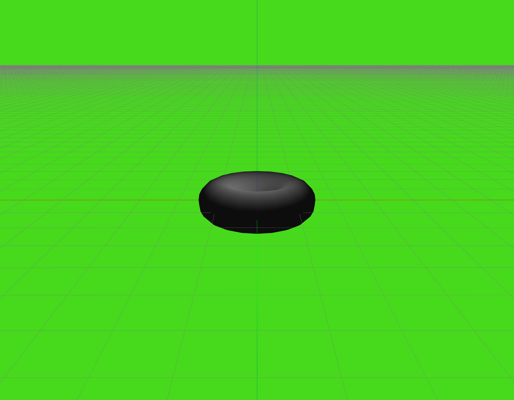
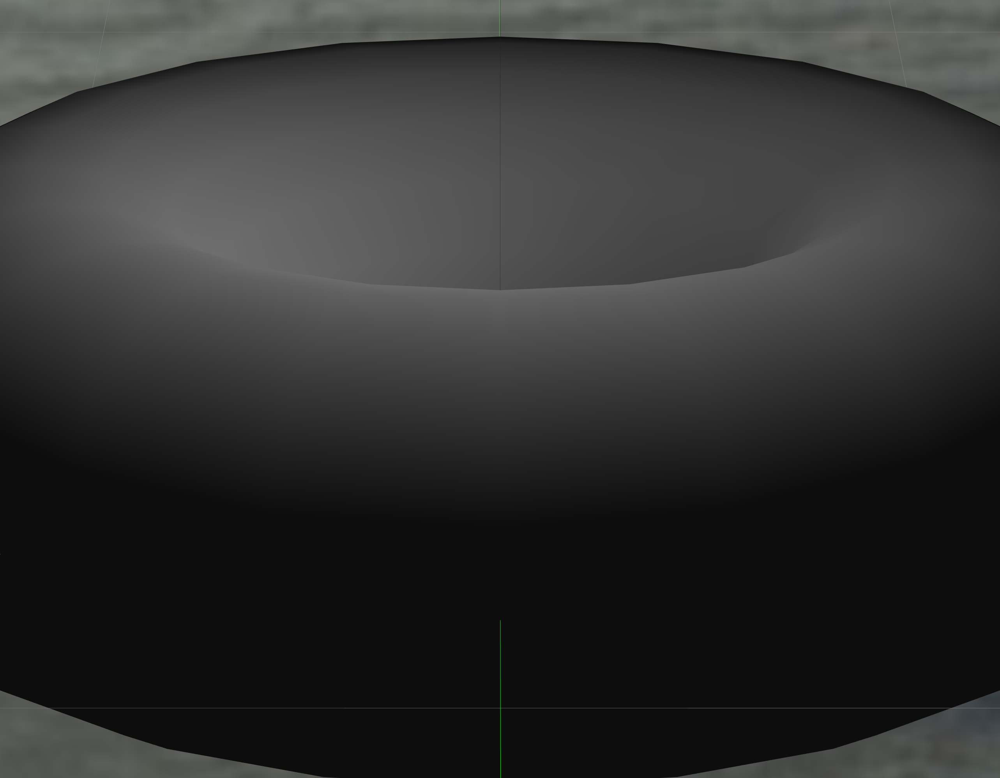
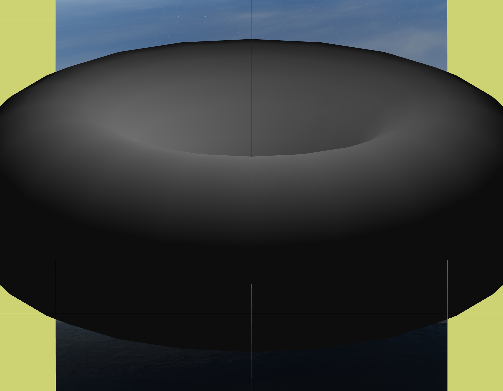
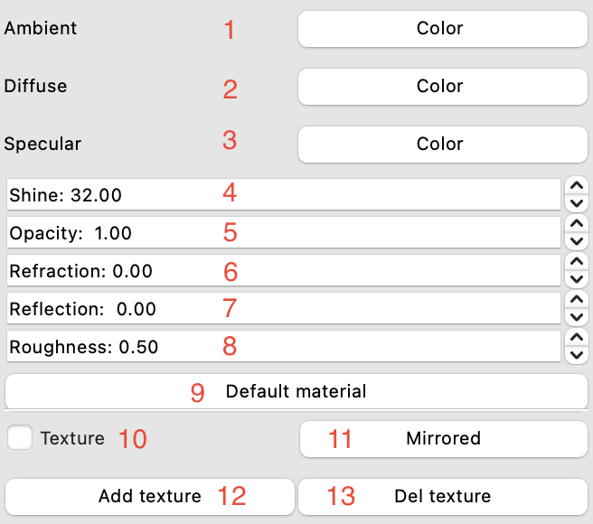
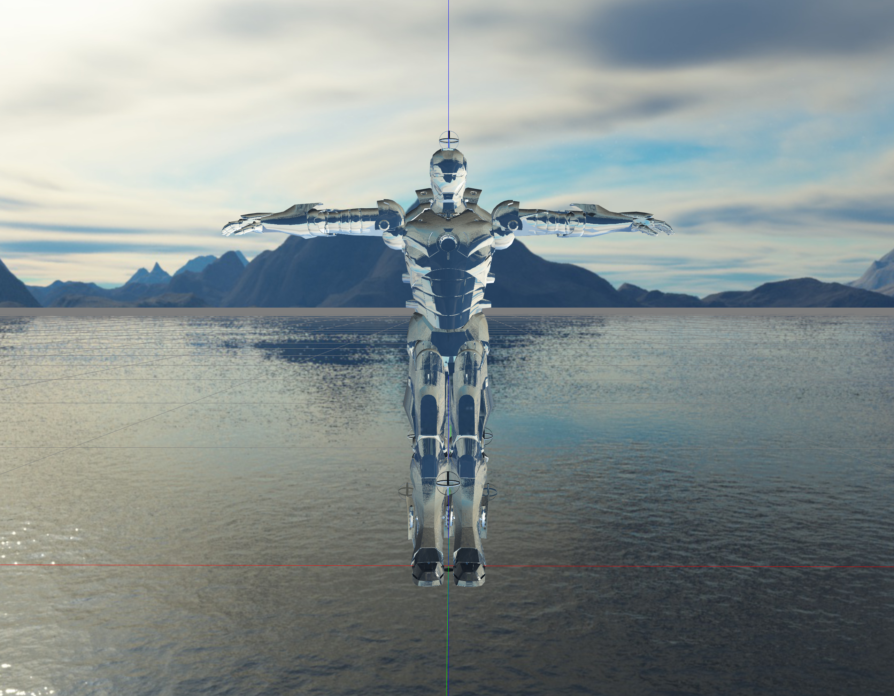

<h1 align="center"> V3D </h1>

<h2 align="center"> Вид главного окна </h2>

1. Зона отображения объекта
1. Основные настройки приложения
1. Область управления объектом/сценой
1. Область управления светом
1. Область управления текстурами

С тремя описанными выше областями возможно производить различные манипуляции (отображать поверх зоны отображения, закрывать/открывать, изменять размер и местоположение), например так:

<h2 align="center"> Основные настройки </h2>
<h3><b> Вкладка файл: </b></h3>

1. Загрузить модель из файла (формат obj)
1. Сделать изображение текущего состояния зоны отображения, при нажатии открывается дополнительное окно (скриншот представлен ниже) выбора формата изображения и его разрешения, которое пользователь может задать вручную, либо выбрать из соответствующих пресетов

<h3><b> Вкладка модель: </b></h3>

1. Ребра
    - Способ отображения (по умолчанию none)
        - none - не отображать ребра у объекта
        - линия - отображать ребра линиями
    - Размер - изменить толщину линий
    - Цвет - изменить цвет линий
1. Вершины
    - Способ отображения (по умолчанию none)
        - none - не отображать вершины у объекта
        - Круг - отображать вершины кругами
        - Квадрат - отображать вершины квадратами
    - Размер - изменить радиус точек
    - Цвет - изменить цвет точек
1. Текстуры
    - Способ отображения (по умолчанию поверхность)
        - none - не отображать текстуры
        - Каркас - отображать каркасную модель объекта
        - Поверхность - отображать модель поверхностями

 При изменении толщины линии, отображается вспомогательное окно с наглядным отображением толщины и возможностью ее изменения: 

<h2 align="center"> Примеры: </h2>

| Способ отображения ребер |  | Толщина ребер |  | Цвет ребер |  |
| :---: | :---: | :---: | :---: | :---: | :---: |
| `none` |  | `defaut` |  | `defaut` |  |
| `Линия` |  | `default++` |  | `pink` |  |

| Способ отображения вершин |  | Радиус вершин |  | Цвет вершин |  |
| :---: | :---: | :---: | :---: | :---: | :---: |
| `none` |  | `defaut` |  | `defaut` |  |
| `Круг` |  | `default++` |  | `pink` |  |
| `Квадрат` |  |

| Способ отображения текстур | `none` | `Каркас` | `Поверхность` |
| :---: | :---: | :---: | :---: | 
| |  |  |  |

<h3><b> Вкладка сцена: </b></h3>

1. Цвет - изменить цвет сцены (корректно отображается только при отключенном окружении)
1. Свет
    - Плоское затенение - равномерное на весь полигон
    - Мягкое затенение - использует градиентное изменение цвета полигона
1. Тип проекции
    - Центральная 
    - Параллельная
1. Сетка (оси координат и квадратики в пространстве)
    - none
    - Отображать
1. Сглаживание
    - Твердые ребра
    - Мягкие ребра
1. Окружение (ландшафт вокруг)
    - none
    - Отображать

<h2 align="center"> Примеры: </h2>

| `Желтый цвет сцены` | `Зеленый цвет сцены` |
| :---: | :---: | 
|  |  |

| `Плоское затенение` | `Мягкое затенение` |
| :---: | :---: | 
|  |  |

| `Центральная проекция` | `Параллельная проекция` |
| :---: | :---: | 
|  |  |

| `Отображать сетку` | `Сетка none` |
| :---: | :---: | 
|  |  |

| `Отображать окружение` | `Окружение none` |
| :---: | :---: | 
|  |  |

<h2 align="center"> Область управления объектом </h2>

<table align="center">
<tr> 
    <td>  </td>
    <td>

        1-2. Смещение по оси X  
        3-4. Смещение по оси Y  
        5-6. Смещение по оси Z  
        7. Шаг смещения  
        8. Текущая координата по оси X  
        9. Текущая координата по оси Y  
        10. Текущая координата по оси Z  
        11. Вращение относительно оси X  
        12. Вращение относительно оси Y  
        13. Вращение относительно оси Z  
        14. Пропорциональное изменение модели по оси X  
        15. Пропорциональное изменение модели по оси Y  
        16. Пропорциональное изменение модели по оси Z  
        17. Пропорциональное изменение модели по всем осям одновременно  
        18. Приводит размеры объекта к единичному формату  
        19. Наводит камеру на выбранный объект  
        20. При выборе сцены, пользователь будет изменять параметры всех объектов  
        21. При выборе конкретного объекта, пользователь будет изменять параметры этого объекта  
        22. При выборе конкретной части объекта, пользователь может изменять только материалы этой части 
        23. При нажатии на поле remove рядом с объектом, объект удаляется со сцены
    
</td>
</tr>
</table>

<h2 align="center"> Примеры: </h2>

| `Оригинал` | `Смещение по X` | `Смещение по Y` | `Смещение по Z` |
| :---: | :---: | :---: | :---: | 
|  |  |  |  |
| `Поворот по X` | `Поворот по Y (по Z 45)` | `Поворот по Z` | `Total scale` |
|  |  |  |  |
| `Scale X` | `Scale Y` | `Scale Z` | `Normalize` |
|  |  |  |  |

<h2 align="center"> Область управления светом </h2>

<table align="center">
<tr> 
    <td>  </td>
    <td>

        1. Цвет свечение самого объекта  
        2. Цвет рассеивающегося света  
        3. Цвет отражающегося света  
        4. Направление света  
        5. Положение источника света в пространстве  
        6. Дистанция луча  
        7. Внутренний круг освещаемого пространства  
        8. Внешний круг зоны рассеивания света  
        9. Статус глобального источника света  
        10. Статус позиционных источников света и их список  
        11. Статус узконаправленных позиционных источников света и их список
    
</td>
</tr>
</table>

<h2 align="center"> Область управления текстурами </h2>

<table align="center">
<tr> 
    <td>  </td>
    <td>

        1. Фоновое освещение  
        2. Диффузное освещение  
        3. Освещение зеркальных бликов  
        4. Коэффициент блеска  
        5. Коэффициент прозрачности  
        6. Коэффициент преломления  
        7. Коэффициент отражения  
        8. Коэффициент шероховатости  
        9. Задать всем коэффициентам значения по-умолчанию 
        10. Включить/выключить отображение загруженной текстуры 
        11. Перевернуть текстуру 
        12. Добавить текстуру 
        13. Удалить текстуру
    
</td>
</tr>
</table>

<h2 align="center"> Примеры: </h2>

| `Блик` | `Отражение` | `Прозрачность` |
| :---: | :---: | :---: |
|  |  |  |

